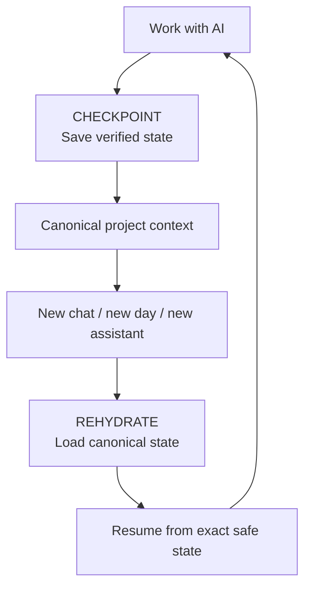

# Project Rehydrate

**by Caelvrix**

**A continuity protocol for long-running AI-assisted IT and technical work.**

Long technical projects outlive chats, context windows, browser sessions, and human memory.

Project Rehydrate keeps one small external source of truth so a human and an AI assistant can resume work **without guessing where they left off**.

Here, **canonical** simply means the file or record everyone agrees is the current source of truth. **Rehydrate** means loading a fresh AI session from that saved state instead of reconstructing the project from memory.

Developed and field-tested primarily with ChatGPT; designed to be vendor-neutral.

Project Rehydrate is published by **Caelvrix**, an independent technical publishing identity focused on practical, reusable systems knowledge.

## The whole idea in 30 seconds

At the end of meaningful work, record:

```text
Last verified milestone:
Current safe state:
Unresolved:
Exact next action:
Do not do yet:
```

At the start of the next session, reload that state before doing substantial work.

Three commands make the workflow memorable:

- **REHYDRATE** — reload canonical project state.
- **STATUS** — show where the project safely stands.
- **CHECKPOINT** — persist the latest verified milestone.

## The flow



## Why this exists

Without an external continuity layer, long AI-assisted work tends to drift:

- old instructions survive after plans change;
- temporary working files outrun the notes;
- multiple workstreams get mixed together;
- assistants reconstruct plausible history instead of loading verified state;
- giant handoff summaries become hard to audit;
- a successful command gets mistaken for a successful outcome.

Project Rehydrate grew out of those failures. The painful parts are documented in [Field Notes and Growing Pains](FIELD_NOTES_AND_GROWING_PAINS.md).

## Try it in 5 minutes

Go straight to **[5_MINUTE_START.md](5_MINUTE_START.md)**.

You only need:

1. one master context file;
2. one current-state file;
3. REHYDRATE / STATUS / CHECKPOINT;
4. the discipline to record an exact safe state and exact next action.

## Who this is for

Anyone doing long-running AI-assisted IT or technical work, including:

- systems administration, infrastructure, networking;
- cybersecurity and incident response;
- cloud, databases, data, BI and analytics;
- software and automation;
- ERP and business systems;
- IT governance, architecture and support;
- technical research and troubleshooting.

## Start simple, go deeper only when needed

- [5 Minute Start](5_MINUTE_START.md) — use the pattern immediately
- [Quickstart](QUICKSTART.md) — small practical implementation
- [Reference Card](REFERENCE_CARD.md) — day-to-day cheat sheet
- [Protocol](PROTOCOL.md) — full operating model
- [Checkpointing](CHECKPOINTING.md) — verified write workflow
- [Failure Modes](FAILURE_MODES.md) — common ways continuity breaks
- [Growing Pains](FIELD_NOTES_AND_GROWING_PAINS.md) — how the protocol evolved
- [Recovery Playbook](RECOVERY_PLAYBOOK.md) — recover after drift or partial failure
- [AI Platform Compatibility](COMPATIBILITY.md) — ChatGPT, Claude, Gemini, Copilot, local models and more
- [Prompt Patterns](PROMPT_PATTERNS.md) — reusable prompts
- [Adoption Guide](ADOPTION_GUIDE.md) — use it without creating bureaucracy
- [Git-backed Continuity](GIT_BACKED_CONTINUITY.md) — optional private-repository integration, verified checkpoints and independent backups
- [FAQ](FAQ.md) — common questions

Advanced / project-maintainer docs:

- [Roadmap](ROADMAP.md)
- [Governance](GOVERNANCE.md)
- [Security & Privacy](SECURITY.md)
- [Contributing](CONTRIBUTING.md)

## What this does not replace

Project Rehydrate does not replace Git, tickets, runbooks, architecture documentation, backups, secrets management, or technical judgment.

It is the continuity layer between those systems and the AI-assisted work happening around them.

## Status

**v0.1 preview**

The protocol is intentionally being published early so practitioners can test it, break it, improve it, and contribute real failure cases.

## License

[MIT](LICENSE)

## Why publish it?

Many of us learned computing because strangers documented obscure fixes, posted scripts, and explained things they were never obligated to share.

This is one attempt to put something useful back into that commons.